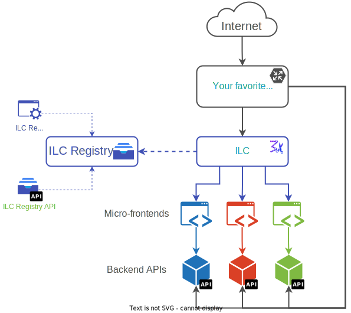

----

[](https://github.com/namecheap/ilc/actions)
[](https://github.com/namecheap/ilc/actions)
[](https://hub.docker.com/r/namecheap/ilc)

Isomorphic Layout Composer (ILC) - layout service that compose a web page from fragment services. 
It supports client/server based page composition.

It's key difference and advantage against other solutions lays in the fact that it does page composition isomorphically.
It means that page will be assembled at server side using apps that support server side rendering (SSR) and after that 
it will be hydrated at client side so all further navigation will be handled by client side rendering.

Such approach allows to **combine advantages of the 
[Micro Frontends](https://martinfowler.com/articles/micro-frontends.html), 
[SPA](https://en.wikipedia.org/wiki/Single-page_application) & 
[Server Side Rendering](https://developers.google.com/web/updates/2019/02/rendering-on-the-web#server-rendering) approaches**.

This repository also contains an example of how you can create a front-end that is composed from multiple 
applications which work in concert and deliver unified experience.

## Why do I need ILC?

Microservices get a lot of traction these days. They allow multiple teams to work independently from each other, choose 
their own technology stacks and establish their own release cycles. Unfortunately, frontend development hasn’t fully capitalized 
yet on the benefits that microservices offer. The common practice for building websites remains “the monolith”: a single frontend 
codebase that consumes multiple APIs.

What if we could have microservices on the frontend? This would allow frontend developers to work together with their backend 
counterparts on the same feature and independently deploy parts of the website — “fragments” such as Header, Product, and Footer. 
Bringing microservices to the frontend requires a layout service that composes a website out of fragments. ILC was developed to solve this need.

## Used core technologies
1. [single-spa](https://single-spa.js.org/) - framework for front-end microservices
2. [TailorX](https://github.com/StyleT/tailorx) - backend layout service that uses streams to compose a web page from fragment services

## Architecture overview



## Maturity level

Currently project is under active development and some of the features are missing. 
Stay tuned with us.

## Repo structure
```
|– adapters: folder contains customized "single-spa" adapters for different frameworks
|– devFragments: folder contains demo apps used for local testing & demonstration purposes
|– ilc: code of the Isomorphic Layout Composer
|– registry: app that contains configuration used by ILC. Such as list of micro-fragments, routes, etc...
```

## Installation and setup
1. Clone the repo
2. _For Namecheap employees only_: clone 
"[ilc.internal](https://git.namecheap.net/projects/RND/repos/ilc.internal/browse)" 
repo and follow the guide to setup NC specific applications.
3. Run `npm install`
4. Run `npm run build`
5. Run `npm start`
6. Open running code at `http://localhost:8233/`
7. Registry UI is available at `http://localhost:4001/`

## Further reading

* [ILC to App interface](docs/ilc_app_interface.md)

## Demo applications & services
### Applications
1. [System](./devFragments/system) (written in vanilla JS, with SSR)
1. [News](./devFragments/news-ssr) (written in Vue.js, with SSR)
1. [Navigation](./devFragments/navbar) (written in React, with SSR)
1. [People](./devFragments/people) (written in React, no SSR)
1. [Planets](./devFragments/planets) (written in Vue.js, no SSR)

### Services
1. [fetchWithCache](./devFragments/fetchWithCache) (used by News & People)

## Notes

### Why `@portal/`
We're using webpack (a static module bundler) to build each application for our micro-frontend approach. Webpack requires
access to everything it needs to include in the bundle at build time. This means when an app that imports a service,
for example planets importing the fetchWithCache service, webpack will try to bundle the service into the planets bundle.
The built in way to avoid webpack doing this is [webpack externals](https://webpack.js.org/configuration/externals/), 
using externals works really well but to avoid having to include a regex for each service I'm using the postfix to signal 
to webpack (and developers) that the import is another micro-app/service/front-end. The prefix isn't required if you 
would rather include a different postfix or none at all it should work, you'll just have to modify each webpack config 
for externals.

### Code splitting
Code splitting is a complicated topic. I'm not going to dive into each facet of it within Webpack, see [Webpacks docs for 
that](https://webpack.js.org/guides/code-splitting/).

In our project code splitting is further complicated because webpack's module format expects to load more modules from 
the website root, which will always fail in this project unless webpack is told where to load additional modules. Right
now there is a single example of this, [done in the people application](./devFragments/people/src/people.js#L10).
