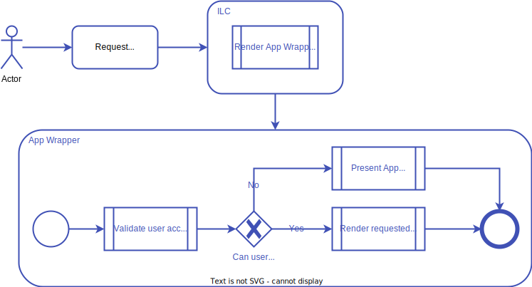

# Wrapper for Applications

> Note: This is an advanced feature of ILC. In most of the cases you won't need it.

This feature is useful if you want to extract some bootstrap, loading or authorization functionality from different apps 
and being able to control it from a single place. 

This is useful if you're building a store where pages for different products will be developed by different teams and so
will reside in different Micro Frontends. In this case you may want to extract logic that check if product has been already 
purchased by the customer to standalone app which would perform the check and render some UI for purchase if necessary.

## Registry configuration

To use this feature you need to have ILC Registry configured in the following way:

1. Register App Wrapper app in Registry and set it's `kind` property to `wrapper`.
1. For the apps that you want to wrap with Wrapper - set `wrappedWith` property to the name of the app from the 1st step.

> Notes: 
> - It's impossible to use apps with `kind = wrapper` in routes directly.
> - If Wrapper App doesn't support SSR - it's will be ignored for all wrapped apps. So remember: if you need to create 
> wrapper for apps with SRR - wrapper also should be SSR capable.

## How to build App Wrapper

Essentially App Wrapper is a regular ILC application which receives extra property which allows to render target application 
with optional extra props when needed. Look at the [demo wrapper for reference implementation](https://github.com/namecheap/ilc-demo-apps/tree/master/apps/wrapper).
To see it in action [go to our demo website](http://demo.microfrontends.online/wrapper/). 

### Client side API

At client side Wrapper App receives an additional property `renderApp` via [ILC to App interface](https://namecheap.github.io/ilc-sdk/pages/Pages/ilc_app_interface.html).

### Server side API

At server side application should be using [IlcAppWrapperSdk](https://namecheap.github.io/ilc-sdk/classes/_server_ilcappwrappersdk_.ilcappwrappersdk.html) 
from [ilc-sdk](https://github.com/namecheap/ilc-sdk) instead of the regular [IlcSdk](https://namecheap.github.io/ilc-sdk/classes/_server_ilcsdk_.ilcsdk.html) class.

It exposes additional `forwardRequest` method which can be used to forward SSR request to target app and so render it 
immediately at client side w/o even executing App Wrapper's code during initial CSR on page load.