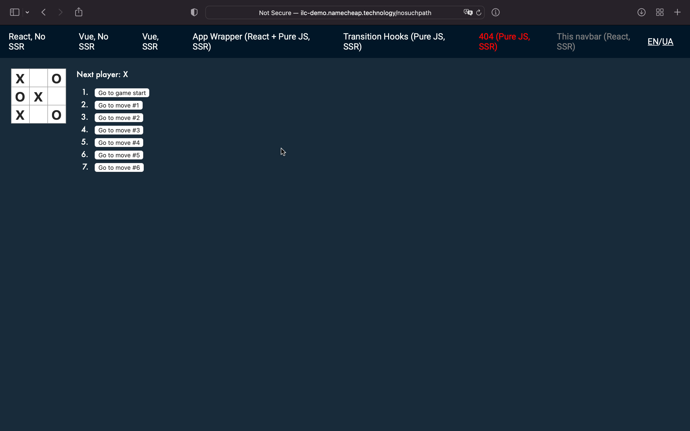

# React application + ILC. Lesson 1

Hello everyone!

In this document, you will learn how to create a simple isomorphic React application and run it with ILC in a few minutes.

Let's get started 🚀

## Get your React application ready

To build a new micro-frontend, you need a React application with SSR support.

To make things easier, you can clone the [application](https://github.com/StyleT/ilc-learning-react) that we've prepared for you, or start with this application [running in the cloud](https://codesandbox.io/s/github/StyleT/ilc-learning-react). For the sake of simplicity, it is recommended to use the cloud version.

!!! hint ""
    Don't forget to play the tic-tac-toe game before we actually get started 😎

## Adapt the application to ILC

To make the application work correctly with ILC, you need to make it compliant with the [ILC to App interface](https://namecheap.github.io/ilc-sdk/pages/Pages/ilc_app_interface.html).

To do this, go through the source code and resolve **all** the `//TODO:` comments that were placed there for you (Hint: there are 4 of them 😉)

Once you're done, restart the application and navigate to the `/microfrontend` route. You should get a `200 OK` response code and SSR markup as a result.

!!! hint ""
    If you are facing troubles during this step, feel free to switch to the `step_1-ILC_integration` branch which has all the required changes already made for you.

## Configure ILC to handle the application

In this step, you will use the public demo website and the "[Develop at "production"](../../develop_at_production.md)" feature to complete the task.

!!! note ""
    If you want more control over the process, you may want to use ILC locally

To configure your micro-frontend:

1. Determine your `publicPath` and `ssrPath`:

    1. For `codesandbox.io`:
        * **`publicPath`**: `https://xxxxx.sse.codesandbox.io/public/`
        * **`ssrPath`**: `https://xxxxx.sse.codesandbox.io/microfrontend`

        where `xxxxx` are random alphanumeric characters. Check the address bar of your virtual browser.
    
    1. For local instance:
        * **`publicPath`**: `http://127.0.0.1:5000/public/`
        * **`ssrPath`**: `http://<white_ip_address>:5000/microfrontend`
        
        where `<white_ip_address>` is the real IP address of your machine or the one generated via services like [ngrok](https://ngrok.com/).

        !!! hint ""

            To work with ILC via `ngrok`, you need to create a free account at [ngrok.com](https://dashboard.ngrok.com/signup) and obtain an `authtoken`.


    ??? example "Examples of `publicPath` and `ssrPath`"

        === "codesandbox.io"

            * **`publicPath`**: `https://1a2b3.sse.codesandbox.io/public/`
            * **`ssrPath`**: `https://1a2b3.sse.codesandbox.io/microfrontend`

        === "local instance"

            * **`publicPath`**: `http://127.0.0.1:5000/public/`
            * **`ssrPath`**: `http://123.456.78.90:5000/microfrontend`

            If you're using `ngrok`, assuming it is launched via `ngrok http 5000`

            * **`publicPath`**: `http://127.0.0.1:5000/public/`
            * **`ssrPath`**: `http://14de-77-120-151-199.ngrok.io/microfrontend`
        

1. Update the ILC configuration:
    1. Navigate to the http://ilc-demo.namecheap.technology/nosuchpath
    1. Execute the code below in the browser console (Developer tools):

        ```js
        var publicPath = 'https://xxxxx.sse.codesandbox.io/public/';
        var ssrPath = 'https://xxxxx.sse.codesandbox.io/microfrontend';
        var overrideConfig = encodeURIComponent(JSON.stringify({
        apps: {
            '@portal/myapp': {
            spaBundle: publicPath + 'client.js',
            cssBundle: publicPath + 'style.css',
            ssr: {
                src: ssrPath,
                timeout: 10000,
            },
            props: { publicPath },
            kind: 'primary',
            },
        },
        routes: [{
            routeId: 555,
            route: '/nosuchpath',
            slots: {
            body: {
                appName: '@portal/myapp'
            }
            }
        }]
        }));

        document.cookie = `ILC-overrideConfig=${overrideConfig}; path=/;`
        ```

1. Refresh the page after code execution.

    You should see your application running inside the public ILC demo website.

    
    
    If you can't - check both `publicPath` and `ssrPath`, and ensure that links to JS/CSS resources are correct.

    ??? hint "CORS issues in Google Chrome"
        If you're using Google Chrome and keep receiving 500 error with the following message:

        !!! danger ""
            Access to script at 'http://127.0.0.1:5000/public/client.js' from origin 'http://ilc-demo.namecheap.technology' has been blocked by CORS policy: The request client is not a secure context and the resource is in more-private address space `local`.

        you may need to temporarily [disable checks for secure content][1] after the recent [Private Network Access update][2] made to the browser

        [1]: https://programmerah.com/solved-chrome-error-the-request-client-is-not-a-secure-context-44246/
        [2]: https://developer.chrome.com/blog/private-network-access-update/

Congratulations! 🎉 Now you know how to integrate your new React application with ILC.