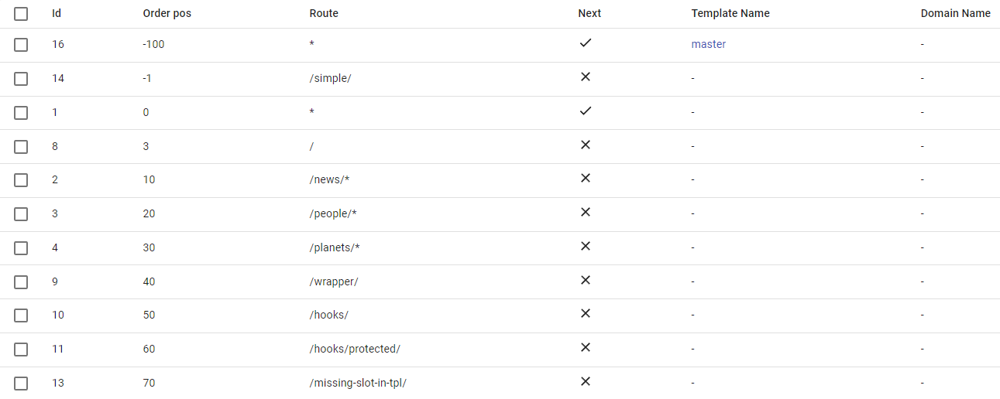
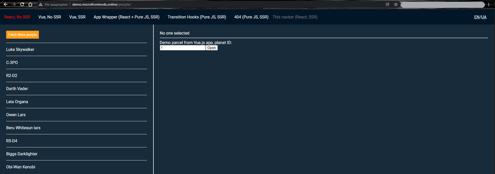
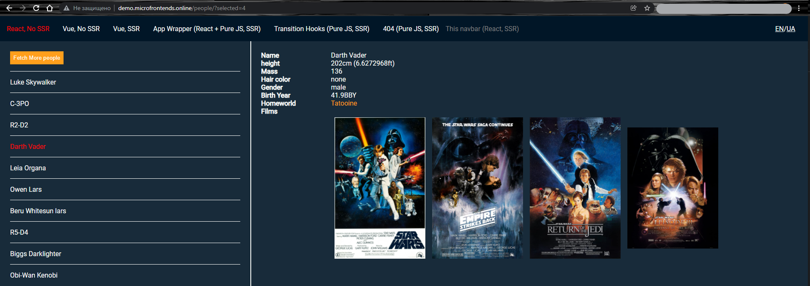

# Introduction

Most JavaScript frameworks come with a dedicated routing solution
like `angular/router` or `vue-router`. They make it possible to
navigate through different pages of an application without having to
do a full page refresh on every link click.
Since we no longer have one monolithic application that handles all routes, instead we have several independent applications, we need to solve an important issue, namely routing.

The following describes how this is handled in the ILC, but first let's clear up the terminology:

 - Hard transitions - Transition in which the application on the page is replaced by another one.

 - Soft transitions - A transition that only replaces the content within the app, not the app itself.

  

#

Now, let's talk a little about the theory, after which we will move on to practical examples:

 In ILC, we can use one HTML template for all of our applications. With this approach, SSR occurs once when the page is first loaded, then all navigation occurs through CSR. So let's look at navigation in more detail:

 For clarity, here is the routing table:
 

Let's go to the `/people/` route, it will be a `hard transitions` because we render a new application on the `/people/*` route.

Now let's pick someone from the list:

Now our route looks like this: `/people/?selected=4/`, this time it's a `soft transition` because `/?selected=4/` is navigation within the app.

Now let's recap:
Due to the fact that we use one HTML template for all pages, SSR occurs only once, then all navigation happens with the help of CSR and uses both hard and soft transitions, depending on the situation.