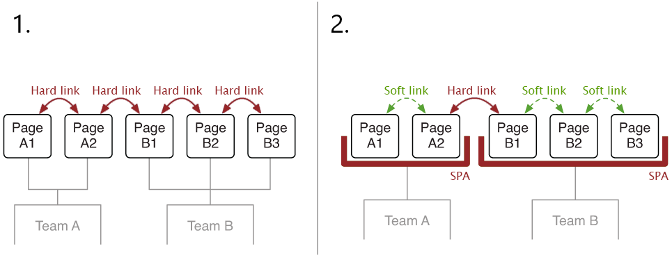
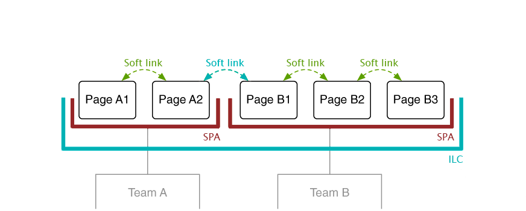

# Introduction

Most JavaScript frameworks come with a dedicated routing solution
like `angular/router` or `vue-router`. They make it possible to
navigate through different pages of an application without having to
do a full page refresh on every link click.
Since we no longer have one monolithic application that handles all routes, instead we have several independent applications, we need to solve an important issue, namely routing.

The following describes how this is handled in the ILC, but first let's dive a little into the general theory of the micro frontend routing and clear up the terminology:

 - **Hard navigation** describes a page transition where the browser
 loads the complete HTML for the next page from the server.

 - **Soft navigation** refers to a page transition that’s entirely clientside rendered, typically by using a client-side router. In this
 scenario the client fetches its data via an API from the server.

 Generally, we have several approaches to implement navigation, the image below shows two most popular of them:

  1. Page transitions happen via plain links, which result in a full refresh of the page. Nothing special is needed - Team A must know how to link to the pages of Team B and vice versa.
  2. All transitions inside team boundaries are soft. Hard navigation happens when the user crosses team boundaries. From an architectural perspective, it’s identical to the first approach. The fact that a team uses a SPA for its pages is an implementation detail. As long as it responds correctly to URLs, the other team doesn’t have to care.

 

In ILC, we use third approach called **Unified SPA**. The Unified SPA (Single Page Application) approach introduces a central application container (it's ILC). It handles page transitions between the teams. Here all navigations are soft.

 

Now more detail about ILC:

 In ILC, we can use one HTML template for all of our applications. With this approach, initial page loading occurs only once when the page is first time loaded, then all navigation occurs through CSR. In addition to the fact that all navigation inside the ILC is soft, it also uses **2-tiered routing**.
 
 Unlike the **flat routing** approach, where we would have to specify in the ILC the full route to every page of all our applications, with a **2-tiered routing** approach, we just need to specify in the ILC route to the application. All navigation within the application can be implemented by each developer team using the native tools of their application (like react-router, vue-router etc.).

To make it clearer, here is a small example:

 

 In this example the user opened a page at `/news/latest` URL. ILC looks at the first part of the URL(`/news/`) to determine what application is it for. It correlates to the `/news/*` route configured in ILC, this route contains information about apps that should be loaded on the page and props they need to receive. When we load and mount the application to its container DOM node – we also pass `basePath` property which should be used by application's router during its work. The application's router processes the complete URL to find the correct page inside its single-page application.

 Within the application, we can use our native tools (for example `<Link>` in `React router`) to navigate between pages within the application, and `global link` - it's just <a>, tags to navigate between applications.

 As mentioned before, transition between applications in ILC occurs thanks to the `<a>` tags. To do this, ILC keeps track of all `<a>` tags on the page and handles clicking on them, provided that:
 1. tag contains non-empty `href`.
 2. `event.PreventDefault` not equal `false`
 3. `target` not equal `_self`
 4. This is not a special url (`mailto`, `tel`, etc.)

 Otherwise, the ILC does not take any part in processing the click on the link.

Now let's recap:
 ILC acts as an wrapper for other applications, making all our transitions soft. In addition, we use two-level routing, so that each team can configure routing inside their application as they like, in ILC, you only need to specify the path to the application.