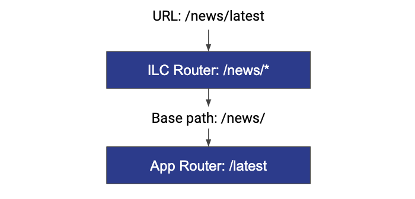

# Introduction

Most JavaScript frameworks come with a dedicated routing solution like `angular/router` or `vue-router`.
They allow you to navigate through pages of an application without a full page refresh on every click.

## Problem statement

When you have a monolithic application, it handles all the routes on its own. When there are two or more applications, they also handle all their routes independently. Since by default, one independent application knows nothing about routes and pages of another independent application. It causes a problem to solve, a routing issue.

## Routing basics

Before proceeding with details on how the issue is handled by ILC, get familiar with the basics of routing in the micro-frontends and terminology:

- **Hard navigation** describes a page transition where the browser
loads the complete HTML for the next page from the server.
- **Soft navigation** describes a page transition that is rendered entirely on the client-side, typically by using a client-side router. In this scenario, the client fetches data from the server via API.

## Solution

### Common approaches

There are several approaches to implement navigation. The common ones are described below:

1. Page transitions happen via plain links, which results in a full page refresh. To proceed with this approach, Team A must know how to link to the pages of Team B and vice versa. No special tooling is required.
1. All transitions inside team boundaries are soft. Hard navigation happens when the user crosses team boundaries. From an architectural perspective, this approach is the same as the first one because Team A still has to know how to link to the pages of Team B (and vice versa) regardless of the details of the internal implementation.

### ILC approach

ILC uses a third approach called **Unified SPA** (Unified Single-page application). It introduces ILC as a central application container that handles page transitions between the teams. In this approach, all the transitions are soft.

In ILC, you can use one HTML template for all of your applications. With this approach, page load occurs only once (during the first time load), after that all navigation occurs via CSR (client-side rendering).

In addition to the fact that all navigation inside the ILC is soft, it also uses **two-tiered routing**. This approach allows you to specify only the base URL of the application in ILC and you don't need to know the full route to each page of the application. All navigation within the application can be implemented by development teams using their application's tools (for example, react-router, or vue-router).
For comparison, in the **flat routing** approach, you need to specify a full URL of each page of all your applications.

In the example above, the user opened the `/news/latest` page URL. ILC checks the first part of the URL (`/news/`) to determine the associated application. It correlates to the `/news/*` route configured in ILC. This route contains information about applications that should be loaded on the page and props these applications need to receive. When the application is loaded and mounted to its container DOM node, it also receives the `basePath` property that should be used by the application's router. The application's router processes the complete URL to find the correct page inside its SPA.

You can use native tools (for example `<Link>` in `React router`) to navigate between pages within the application, and `global link` - a link (`<a>` tag) to navigate between applications.

In ILC, as mentioned before, the transition between applications occurs via the `<a>` tags. To do this, ILC keeps track of all `<a>` tags on the page and handles clicks on them, provided that:

1. Tag contains a non-empty `href`.
1. `event.PreventDefault` does not equal `false`.
1. `target`does not equal `_self`.
1. This is not a special url (`mailto`, `tel`, etc).

If one of the above points is not met, ILC ignores the processing of the clicks on the link.

### Conclusion

ILC acts as a wrapper for other applications making all the transitions soft. Furthermore, it uses two-level routing so that teams can configure routing inside their application as they need to. In ILC, you only need to specify the path to the application.
