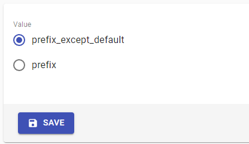
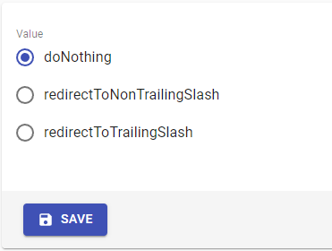

# System settings: [i18n](#i18n) & [Trailing slash](#trailing-slash)

## i18n

ILC comes with built in internationalization support.

While having i18n feature enabled - ILC allows you to handle localized URLs at global level. Currently, we support two routing schemes which can be switched in the `i18n.routingStrategy` menu:

 1. **Prefix_exept_defaut** - prefixing all routes with the locale except those of the default locale
 2. **Prefix** - prefixing all routes with the locale

Prefixes are used only for localization settings, choice of currency type does not affect the URL in any way. In Registry, you continue to specify all routes w/o locale information.

Here's what it looks like in practice:

More details about i18n you can read [here](../i18n.md)

## Trailing slash

A trailing slash is a forward slash (“/”) placed at the end of a URL.
The decision to use a trailing slash or not is more a personal preference than a real need, in any case we provide the ability to control this.

This menu has 3 options:

 

 1. **doNothing** - Doesn't affect the URL in any way.
 2. **redirectToNonTrailingSlash** - Removes slash at the end of the URL if it was there.
 3. **redirectToTrailingSlash** - Adds a slash to the end of the URL if it wasn't there.
