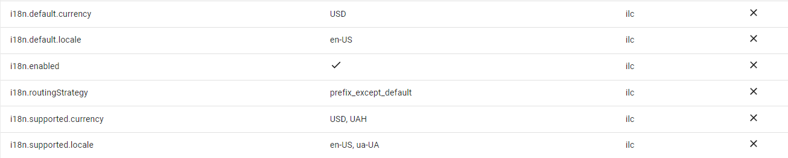
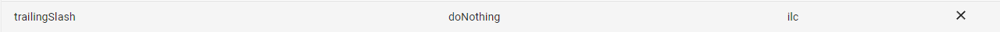

# System settings: i18n and Trailing slash

## i18n

ILC comes with built-in internationalization support.

However, ILC only handles localized URLs at the global level. Currently, it supports two routing schemes that can be switched in the `i18n.routingStrategy` menu:

1. **Prefix except default** - prefix all routes with the locale except those of the default locale.
1. **Prefix** - prefix all routes with the locale

i18n settings allow you to change page language and currency, however, prefixes are used in localization settings only. Currency selection doesn't affect the URL and doesn't add or delete a prefix. In Registry, you specify all the routes without the locale information.

More details about i18n are available in the [Internationalization page](../i18n.md).

## Trailing slash

A trailing slash is a forward slash (`/`) symbol at the end of a URL.
ILC allows you to manage cases with a trailing slash, but the decision to use it is at your discretion, considering personal preference and special cases you may have.

To manage trailing slash behavior, there are the following options:

1. **Do nothing** - No effect at URLs.
1. **Redirect to non-trailing slash** - Remove trailing slash at the end of URLs, if present.
1. **Redirect to trailing slash** - Add trailing slash to the end of URLs, if not present.
