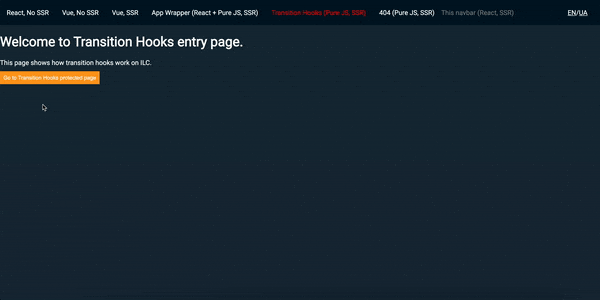

# Route configuration

## Route domains

ILC can handle requests from multiple domains, so you can use a single ILC instance to handle them instead of rolling out individual instances for every domain.

ILC checks the exact match of domain names. It means that `secure.example.com` is not equal to `example.com`, and you may need to add the necessary subdomains to handle this case properly.


!!! note ""
    - Domain name must be without protocol.
    - Empty `Domain Name` field means the main app domain.
    - To add a new domain, go to the **Router domains** section in the sidebar.
        
        ??? tip "Add a new domain"
            

!!! note ""
    ILC renders applications for only one domain at the same time. To add one header to several domains, you need to create the same route several times specifying the required domain for each route.

    For example:

    

    where:

    * :fontawesome-solid-square:{ .color-green } - render for the main domain
    * :fontawesome-solid-square:{ .color-red } - render for the `127.0.0.1` domain only

More information about domains is available in the [Multi-domains page](../multi-domains.md).

## Route template

Template is an HTML file that is used to build the structure of your page. If it is missing in the routing chain, ILC won't be able to render your content properly and will throw an error.


!!! warning "Important note"
    There must be at least one template in the routing chain.

    ??? tip "Create a template"
        To create a template, go to the **Templates** section in the sidebar.

        

## Route metadata

The `Metadata` field allows you to configure additional route properties that can be used by ILC core or plugins. This field accepts a JSON object with various properties.

!!! info ""
Some metadata properties are handled by plugins, not by ILC core. ILC supports custom plugins, and you can learn more about them in the [ilc-plugins-sdk repository](https://github.com/namecheap/ilc-plugins-sdk).

### Complete metadata configuration

Here's a complete example of route metadata with all supported options:

```json
{
    "protected": true,
    "canonicalUrl": "/products/main",
    "redirect": {
        "location": "/domain-search/",
        "code": 301
    },
    "customProperty": "value"
}
```

### Supported core options

#### `canonicalUrl`

-   **Type**: `string`
-   **Purpose**: Specifies the canonical URL for the route. This is used for SEO purposes to indicate the preferred URL when multiple URLs might display similar or identical content.
-   **Format**:
    -   Must be a relative path (e.g., `/products/main`): Will be combined with the current domain
    -   Absolute URLs (starting with `http://` or `https://`) are not supported and will be ignored
-   **Behavior with i18n**: When using i18n, the canonical URL will be automatically localized based on the current locale.
-   **Implementation**: ILC automatically adds a `<link rel="canonical">` tag to the page's `<head>` section with the specified URL.

Example:

```json
{
    "canonicalUrl": "/products/main"
}
```

This will generate the following HTML in the page head:

```html
<link rel="canonical" href="https://yourdomain.com/products/main" data-ilc="1" />
```

#### `redirect`

-   **Type**: `object`
-   **Purpose**: Configures a redirect for the current route to another location. This is useful for URL migrations, SEO improvements, or directing users to the correct page.
-   **Properties**:
    -   `location` (string): The destination URL to redirect to. Can be a relative path or absolute URL.
    -   `code` (number): The HTTP status code for the redirect. Typically 301 (permanent) or 302 (temporary).
-   **Behavior**: When a user visits a route with a redirect configuration, they will be automatically redirected to the specified location with the appropriate HTTP status code.

Example:

```json
{
    "redirect": {
        "location": "/domain-search/",
        "code": 301
    }
}
```

This will redirect users from the current route to `/domain-search/` with a 301 (permanent) redirect status code.

### Plugin-specific options

#### `protected`

-   **Type**: `boolean`
-   **Purpose**: Determines whether the page should be protected. If set to `true`, access to the protected page will only be granted after the user fulfills the required conditions.
-   **Plugin**: [Transition hooks](https://github.com/namecheap/ilc-plugins-sdk/tree/master/src/plugins/transitionHooks)


#### Custom properties

You can add any custom properties to the metadata object that will be available to your applications through the router. These properties can be used to configure specific behavior for each route in your applications.

### Access the protected page

In the basic scenario, the required condition to access the protected page is to press the `confirm` button. In real world scenarios, you can set any conditions (for example, authorization form).



More information about the Transition hooks plugin is available in the [ILC transition hooks page](../transition_hooks.md).

## Slot configuration

Slot configuration defines the main settings of a route:

- Application.
- Where the application should be displayed.
- How critical the application is for the site.
- Create/change application properties.


!!! tip ""
    If you want to render a page as plain HTML, leave the slot properties empty and ensure that the current route uses the HTML template with no `ilc-slot` tags.

### Configuration

1. **Slot name**
    
    Slot name refers to the value of the `id` attribute of the corresponding `ilc-slot` in the ILC templates. Your application will be rendered inside the `ilc-slot` with the `id` that you specify in the `Slot name`.

    ```html
    </head>
     <body>
       <ilc-slot id="navbar" />
       <ilc-slot id="body" />
       <ilc-slot id="footer" />
     </body>
     </html>
    ```

    !!! warning "Important note"
        You can have only one application per slot. If you add multiple applications to one slot, only the latter one will be rendered.

1. **App name**

    App name refers to the application that will be rendered in the specified slot. Applications in the list are defined in the `Apps` section in the sidebar.

1. **App type**

    There are the following app types:
     
    - **Primary**: set for the vital applications of your **site**. If the application crashes on the server side, ILC won't render it on the client side, and will immediately render an error.
    - **Essential**: set for the vital applications for the **user** (for example, header). If the application crashes on the server side, ILC will try to render it on the client side. It will render an error only if the application crashes on both server and client sides.
    - **Regular**: set for non-critical applications (for example, footer). If the application crashes on both server and client sides, ILC won't render it on the client side and will ignore errors from it.

1. **Props field**

    Props allow you to configure the application separately for each route. With props, you can override the props specified when creating the application in the **Apps** section in the sidebar.
