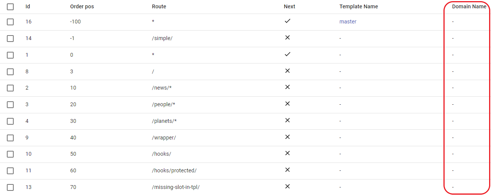
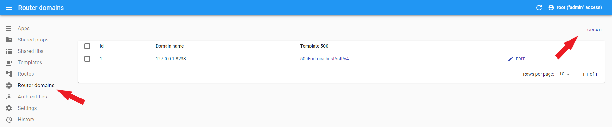
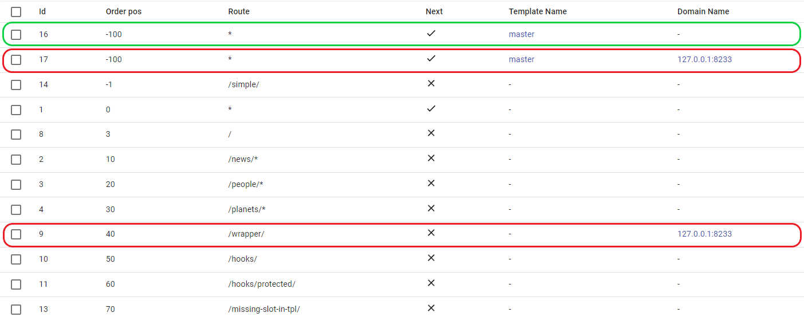
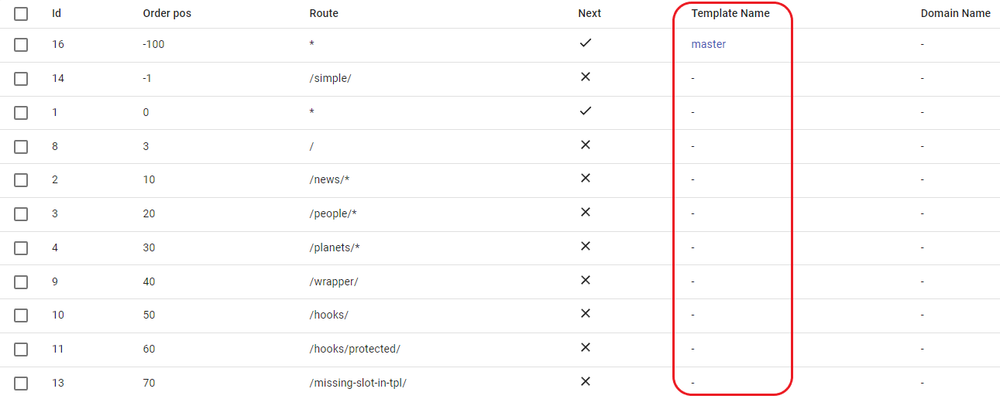
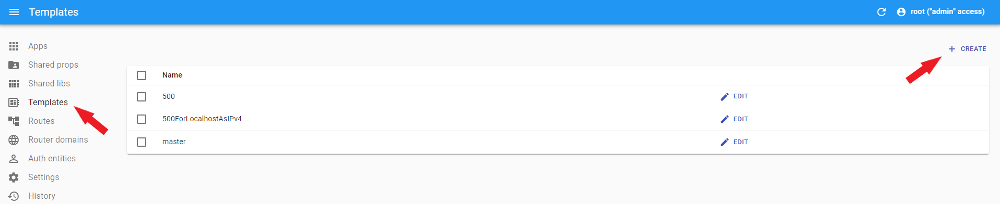
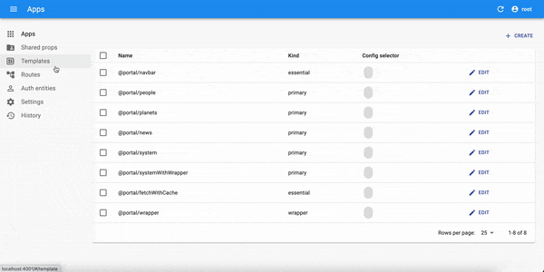
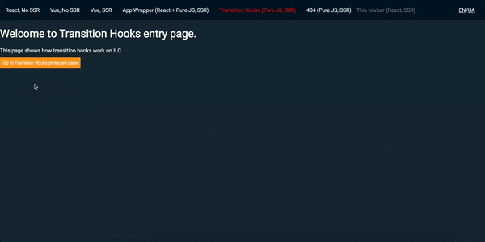
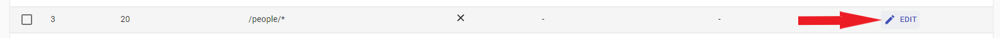
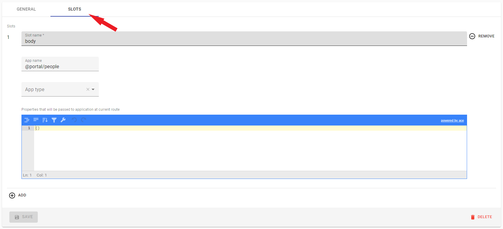
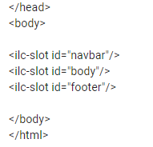

# Route configuration options

 ## Route domains

 ILC will check the exact match of domain names, accordingly, `secure.example.com` is not equal to `example.com`, so you may need to add the necessary subdomains.

 ILC can handle requests coming from multiple domains, so that you don't need to roll out individual instances of the ILC for every domain, you just can use one instance for all of them.

 

 - Domain name, must be without protocol, etc.

 - You can add new domain in **Router domains** menu.

 

 - Empty `Domain Name` field is equal to main app domain.

 - The application renders only one domain at the same time, so in order to add one header to several different domains, you need to create a route several times specifying the required domain for each.

 **For example:**

 
  - render for main domain.
  - render only for `127.0.0.1` domain.

 - You can find more information about domain [here](../multi-domains.md)

 ## Route template

 **Important!** There must be at least one template in the routing chain.

 The template is needed to build the structure of our page. So if you don't create a template, ILC won't know exactly where to render the content and will show you an error instead of the desired page.

 

 - Template it's simple HTML file.

 - You can add new template in **Templates** menu.

  

 ## Route metadata

 Currently only one option is supported - `protected` with values `true` or `false`.

 Used to determine whether the page will be protected, if so, access to it will be granted only after the user fulfills the necessary conditions.

 

 - In this case conditions - it is just pressing the `confirm` button, in practice, you can set any conditions (authorization forms, etc.).

 

 - You can read more about protected route [here](../transition_hooks.md)

 ## Slot configuration

 Here are the main settings of our route, here we indicate exactly where our application will be displayed, the application itself, how critical this application is for our site, we can create new/change the current props of the application.

 
 

 1. **Slot name:**

      -  - Our templates have `ilc-slot`. In the `Slot Name` field, you must enter a name corresponding to the `ilc-slot id`, our application will be rendered inside this slot.

      - **Important!** Only one application can be rendered in one slot, if you add several applications to one slot, only the last one added will be rendered.

 2. **App name:**

      - Here we select the application that will be rendered in the specified slot. The application is selected from the list added to the `Apps` menu.

 3. **App type:**

      There is 3 options:
      - Primary - Set for the vital applications of our **site**, if the application crashes on the server side, ILC will not try to draw it on the client side, and will immediately render an error.

      - Essential - Set for the vital applications for the **user** (header, etc.), if the application crashes on the server side, ILC will try to render it on the client side, and render an error only if the application crashes both sides, on the server and on the client side.

      - Regular - set for non-critical applications (footer, etc.), if the application crashes on both sides, on the server and on the client side, nothing will happen.

  4. **Props field:**

      - This field allows us to configure the application separately for each route.

      - With it, you can override the props specified when creating the application (in the Apps menu).
