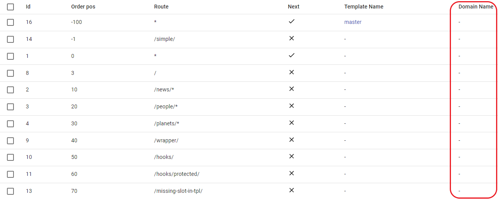
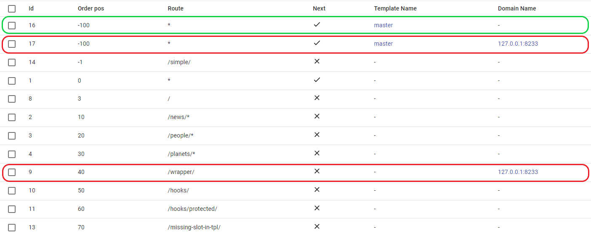
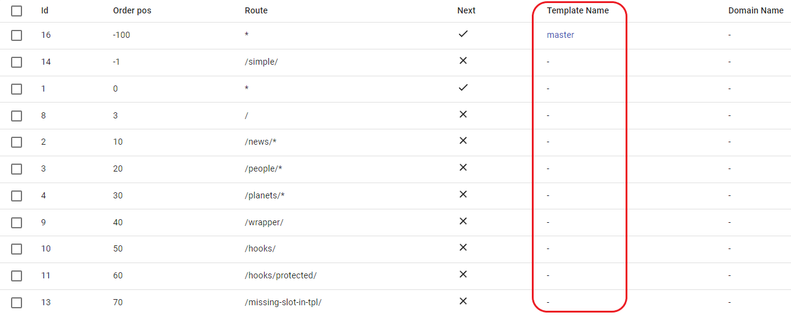
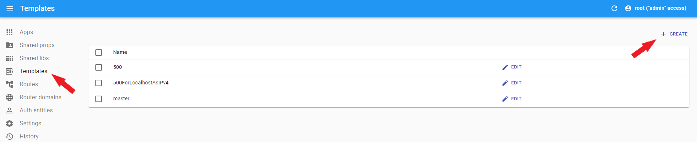

# Route configuration options

## Route domains

 - You can add new domain in **Router domains** menu.

 - Domain name, must be without protocol, etc.

 - Empty `Domain Name` field is equal to main app domain.

 - The application renders only one domain at the same time, so in order to add one header to several different domains, you need to create a route several times specifying the required domain for each.

 **For example:**

 
  - render for main domain.
  - render only for `127.0.0.1` domain.

 - You can find more information about domain [here](../multi-domains.md)

 ## Route template
 

 - Template it's simple HTML file.

 - You can add new template in **Templates** menu.

 

 - Needed to build the structure of our page.

 - **Important!** There must be at least one template in the routing chain.