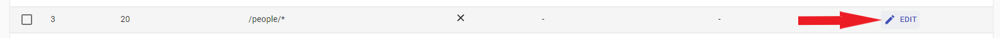
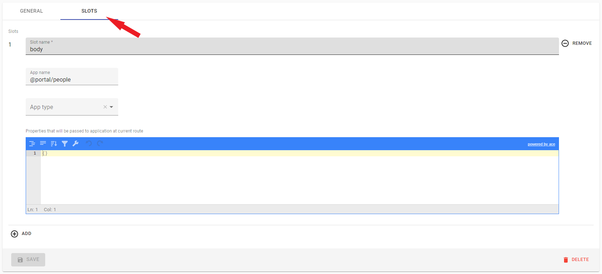
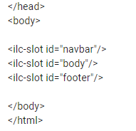

# Route configuration options

 ## Route domains
 

 - You can add new domain in **Router domains** menu.

 - Domain name, must be without protocol, etc.

 

 - Empty `Domain Name` field is equal to main app domain.

 - The application renders only one domain at the same time, so in order to add one header to several different domains, you need to create a route several times specifying the required domain for each.

 **For example:**

 
  - render for main domain.
  - render only for `127.0.0.1` domain.

 - You can find more information about domain [here](../multi-domains.md)

 ## Route template
 

 - Template it's simple HTML file.

 - You can add new template in **Templates** menu.

 

 - Needed to build the structure of our page.

 - **Important!** There must be at least one template in the routing chain.

 ## Route metadata

 

 - Currently only one option is supported - `protected` with values ​​`true` or `false`.

 - Used to determine whether the page will be protected, if so, access to it will be granted only after the user fulfills the necessary conditions, in this case it is just pressing the `confirm` button, in practice, you can set any conditions (authorization forms, etc.)

 

 ## Slot configuration

 
 

 1. **Slot name:**
  -  - Our templates have `ilc-slot`. In the `Slot Name` field, you must enter a name corresponding to the `ilc-slot id`, our application will be rendered inside this slot.

  - **Important!** Only one application can be rendered in one slot, if you add several applications to one slot, only the last one added will be rendered.

 2. **App name:**
  - Here we select the application that will be rendered in the specified slot. The application is selected from the list added to the `Apps` menu.

 3. **App type:**
  There is 3 options:
  - Primary - Set for the vital applications of our **site**, if the application crashes on the server side, ILC will not try to draw it on the client side, and will immediately render an error.

  - Essential - Set for the vital applications for the **user** (header, etc.), if the application crashes on the server side, ILC will try to render it on the client side, and render an error only if the application crashes both sides, on the server and on the client side.

  - Regular - set for non-critical applications (footer, etc.), if the application crashes on both sides, on the server and on the client side, nothing will happen.

  4. **Props field:**
  - With it, you can override the props specified when creating the application (in the Apps menu).