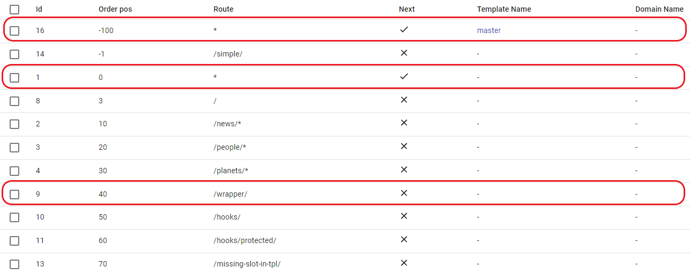

# Match & cascade merge

## Route field

- `*` - matches for any route.

- `/ `- matches only for home page.

- `/news/*` - matches for `/news/` route and any subroute (e.g. `/news/blablabla`).

- `/wrapper/` - matches only for `/wrapper/` route and ignores for any subroute (e.g. `/wrapper/blablabla`).

- Route must be unique for each domain, the exception is `*` (we can use the same order position, provided that the domain names are different).

## Order field

- Only integer numbers are allowed, from minus infinity to plus infinity.

- ILC goes through positions from lowest to highest (more details will be written below in the examples).

- Order positions must be unique for each domain (we can use the same order position, provided that the domain names are different).

## Next field

- It can be set to `true` or `false`

- If it is `true` the ILC will render the content and go to the next route.

- If it is `false` the ILC will render the content and **will not proceed** to the next route.

## Examples:

- Let's try to enter the `/wrapper/` route, ILC will start from the application with the lowest `Order pos` value,
in this case it is `-100`, because its route is `*` it will be rendered, and since the `Next` field is set to `true` ILC will go further along the order, `Order pos -1` **will not be rendered** because the `/simple/` route does not match the given one, we move further to position `0`, render this application because its route `*` and move on, because the `Next` field is set to `true`, next few applications will not be rendered, because their route does not match the specified one, until we reach the position `40`, its route exactly matches the specified one, the application will be rendered, and because `Next` is set to the value `false` ILС will not look for matches further. In total, we will render 3 applications, both routes `*` and route `/wrapper/`.

**Result:**

#

- Now suppose we need to render the page without app with `Order pos 0` and route `*` but with `navbar`, in this case, we need to set the `Order pos` for this route between `0` and `-100` because `-100` it's `navbar` position, so set our route (let this will be `/wrapper/`) accordingly `Order pos -2`. So ILC will start with the application with the lowest value of `Order pos`, it is `-100`, because it's route `*` it will be rendered, and the `Next` field is set to `true`, so the ILC will look for matches further, next one will be `Order pos -2` it's match and it will be rendered, `Next` value set to `false`, so ILС will not look for matches further.

**Result:**

#

- Now let's go to the route `/people/blablabla/`, since in the ILC registry we have the value `/people/*` - ILC will render both routes `*` and the route `/people/*`.

**Result:**

#

- In summary, I want to make it clear that using `Order pos` can flexibly customize the displayed content, for example, for `sidebar, navbar, footer` we set position `0, -100, -1000` and accordingly specifying for the new application a value above zero for its position, on the page will be rendered `sidebar, navbar, footer` and our new app, so set position between `0 and -100` we **don't** render the `sidebar`, between `-100 and -1000` we **don't** render `sidebar` and `navbar`, set the position below `-1000` we will render only new application, without `sidebar, navbar, footer`.

