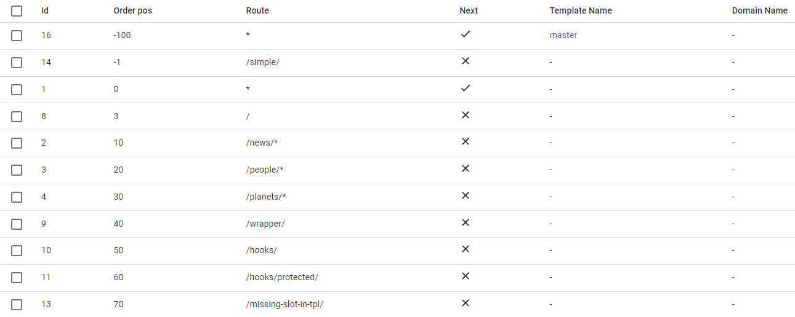
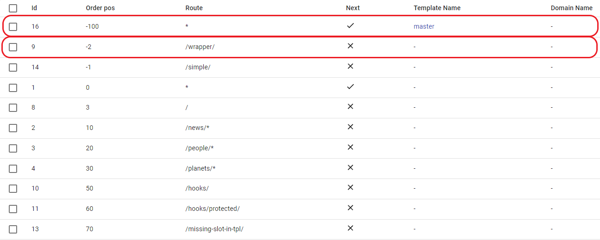

# Route matching patterns

## Match and cascade merge

### Route field

!!! info ""
    - `*` - Matches any route.
    - `/`- Matches home page only.
    - `/news/*` - Matches `/news/` route and any subroute (for example, `/news/blablabla`).
    - `/wrapper/` - Matches only `/wrapper/` route and ignores any subroute (for example, `/wrapper/blablabla`).

!!! warning "Important note"
    Route must be unique for each domain.
    
    Exception is `*` - you can use the same order position, provided that the domain names are different.

### Order field

The `order` field is an integer value that specifies the order in which the fragments should be fetched when constructing pages. ILC goes through positions from lowest to highest.

To specify order position, you can use integer numbers (only) from -&#8734; to +&#8734; .

For more details, refer to the [Examples](#examples) section below.

!!! warning "Important note"
    Order positions must be unique for each domain.
    
    You can use the same order position, provided that the domain names are different.

### Next field

The `next` field is a boolean value that instructs ILC on whether should it move further (`true`) through the list of applications, or stop (`false`) after rendering the current one.

### Examples

#### Prerequisites

Before proceeding with the examples, ensure that your routing table looks as follows:

#### `/wrapper/` route

1. After [configuring your routing table](#prerequisites), navigate to the `http://demo.microfrontends.online/wrapper/`

**ILC side:**
  
1. ILC starts with the application with the lowest `Order pos` value (in this case, `-100`). Its route is `*`, so it is **rendered**. The `Next` field is set to `true`, so ILC goes further to the next route.
1. ILC moves further to position `Order pos -1`. It does **not render** it because the `/simple/` route does not match the given one.
1. ILC moves further to position `Order pos 0`. It **renders** this application because its route is `*`. The `Next` field is set to `true`, so ILC goes further to the next route.
1. The applications with `Order pos` `3`, `10`, `20`, and `30` are **not rendered** because their route does not match the specified one. The `Next` field is set to `true`, so ILC goes further to the next route.
1. ILC moves further to position `Order pos 40`. This is the exact match of the specified route. This application is **rendered**. The `Next` field is set to `false`, so ILС stops.

As a result, there are 3 rendered applications for both `*` routes and for `/wrapper/` route.

#### Render a page with navbar only

In this example, you will instruct ILC to render the `navbar` and skip rendering of the application at the `Order pos 0` and route `*`. You will be working with the `/wrapper/` example route.

To do this:

1. Set the `Order pos` for the `/wrapper/` route to any number between `-100` and `0`. For example, `-2`.
1. Make sure that the `Next` field for the `/wrapper/` route is set to `false`.

!!! info "Explanation"
    Since you want to skip rendering of the application that has the `Order pos 0`, considering that `navbar` has the `Order pos -100`, you need to define your `/wrapper/` route at any place **after** the `navbar` but **before** the application (`-100 < number < 0`).

**ILC side:**

1. ILC starts with the application with the lowest `Order pos` value (in this case, `-100`). Its route is `*`, so it is **rendered**. The `Next` field is set to `true`, so ILC goes further to the next route.
1. ILC moves further to position `Order pos -2`. It **renders** this application because it is a match. The `Next` field is set to `false`, so ILС stops.

#### `/people/blablabla/` route

Since ILC registry already contains the `/people/*` value, ILC renders both `*` and `/people/*` routes.

## Conclusion

As you can see from the examples above, `Order pos` can be used to flexibly manipulate the content you want to show.

A quick recap:

Let's say, you have a page with the following elements: `application`, `sidebar`, `navbar`, `footer`. To skip rendering of a particular element(s), change `Order pos` of your application accordingly. See the examples below:

=== "Render all elements"

    - :material-checkbox-marked:{ .color-green } `footer`: `Order pos -1000`
    - :material-checkbox-marked:{ .color-green } `navbar`: `Order pos -100`
    - :material-checkbox-marked:{ .color-green } `sidebar`: `Order pos 0`
    - :material-checkbox-marked:{ .color-green } `application`: `Order pos 5`

=== "Skip sidebar"

    - :material-checkbox-marked:{ .color-green } `footer`: `Order pos -1000`
    - :material-checkbox-marked:{ .color-green } `navbar`: `Order pos -100`
    - :material-checkbox-marked:{ .color-green } `application`: `Order pos -50`
    - :material-close-box:{ .color-red } `sidebar`: `Order pos 0`

=== "Skip sidebar and navbar"

    - :material-checkbox-marked:{ .color-green } `footer`: `Order pos -1000`
    - :material-checkbox-marked:{ .color-green } `application`: `Order pos -200`
    - :material-close-box:{ .color-red } `navbar`: `Order pos -100`
    - :material-close-box:{ .color-red } `sidebar`: `Order pos 0`

=== "Skip sidebar, navbar, and footer"

    - :material-checkbox-marked:{ .color-green } `application`: `Order pos -1200`
    - :material-close-box:{ .color-red } `footer`: `Order pos -1000`
    - :material-close-box:{ .color-red } `navbar`: `Order pos -100`
    - :material-close-box:{ .color-red } `sidebar`: `Order pos 0`
