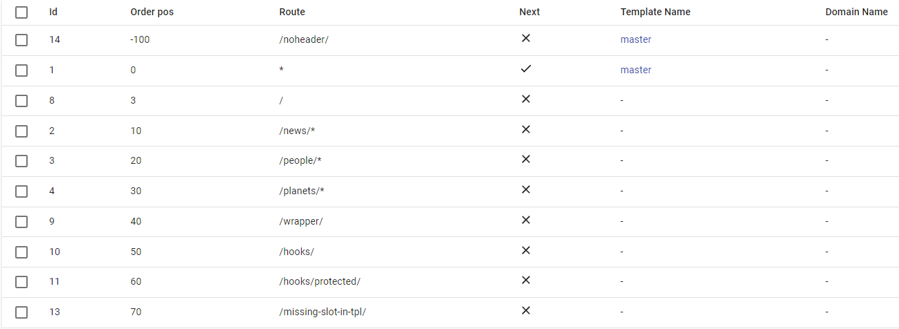
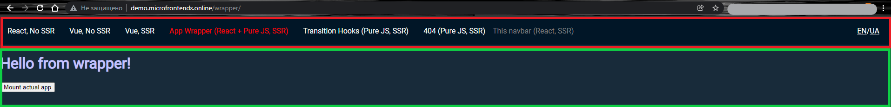

# Route transition & animation

## Overall principle

As you may have read in [intoduction](./introduction.md), all transitions in ilc are soft, which means that we can replace, add, remove applications on the page without reloading it, this is possible due to the use of one HTML template for all pages.

At this point, let's take a closer look. Our templates contain so called [ilc-slots](.\route_configuration_options.md#slot-configuration) and our applications are rendered inside these slots. Only one application can be displayed in one slot at a time.

Now let's look at this with examples:

We use this routing table:

In our HTML template - 2 ilc-slots: 

let's go to the `/wrapper/` route, in this case we'll render the app in both slots, the navigation bar () in the `navbar` slot, and the main app () in the `body` slot

Now let's go to the `/hooks/` route, and the app inside the `body` slot will be replaced while the navigation bar will stay in place.

Now let's go to the `/noheader/` route, here we have only one application specified, which is rendered inside the `body` slot, the `navbar` slot is now empty.

In addition, I would like to remind you that routing within applications can be processed by native application tools and not processed in any way in ILC, and accordingly the content will always be located inside the same ILC slot.

## Animation capabilities

No matter how hard we try to optimize the system to minimize the delay and provide users with a well-designed product, there will always be a point where the user has to wait. That is why ILC has a built-in ability to display a spinner when loading an application, despite this, we recommend using more progressive tools like `Skeleton loader` - placeholder for the information that is still loading. It mimic the structure and look of the entire view. But this is just our recommendation, the choice of what to use is up to you, and here you will find descriptions of the standard ILC tools.

Global spinner:

In the settings there are 2 items responsible for this.
 1. `globalSpinner.enabled` - allows you to enable or disable the display of the spinner.
 2. `globalSpinner.customHTML` - allows you to add your custom spinner.