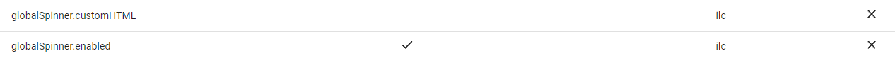

# Route transition and animation

## Overview

As you may have read in [intoduction](./introduction.md), all transitions in the ILC are soft. It means that you can add, remove, and replace applications on the page without reloading thanks to the use of one HTML template for all pages. This template contains so-called [ilc-slots](./route_configuration_options.md#slot-configuration) that are used to render applications. (one application per slot at a time).

For example:

In this example, the routing table looks as follows:


Whereas the HTML template contains two ilc-slots:

  ```html
  <body>
    <ilc-slot id="navbar" />
    <ilc-slot id="body" />
  </body>
  ```

Navigate to the `/wrapper/` route.
In this case, ILC will render the application in both slots: the navigation bar (:fontawesome-solid-square:{ .color-red }) in the `navbar` slot, and the main app (:fontawesome-solid-square:{ .color-green }) in the `body` slot.


Navigate to the `/hooks/` route.
The application inside the `body` slot will be replaced, while the navigation bar will stay in place.


Navigate to the `/noheader/` route.
For this route, there is only one application specified that is rendered inside the `body` slot. The `navbar` slot is empty now.


!!! info ""
    Routing within applications can be processed natively by application tools instead of the ILC. With this routing, the content will always be located inside the same ILC slot.

## Animation capabilities

Regardless of system optimization or how well your product design is, there will always be a point where the user has to wait. For these cases, ILC has a built-in feature to display a spinner when loading an application. 

### Global spinner



There are the following settings to configure spinner behavior:

1. `globalSpinner.enabled` - enable or disable the display of the spinner.
1. `globalSpinner.customHTML` - add your custom spinner.

!!! info ""
    We recommend using more progressive tools like `Skeleton loader` - a placeholder for the information that is still loading that mimics the look and structure of the entire view.