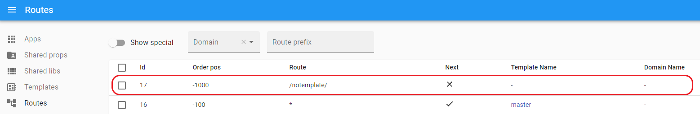
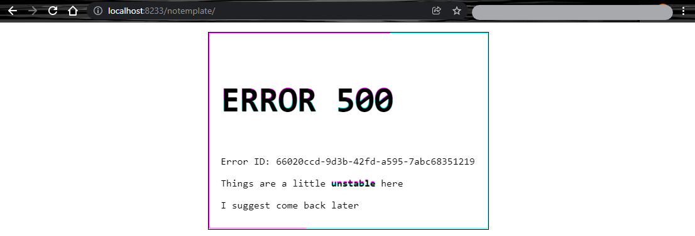

# Special routes

To see special routes, use the `Show special` switcher at the top of the routes page

It is used to render errors, if an application with the `Primary` or `Essential` type falls on the page, ILC will not find a match between the address bar and `Route`, `Template` will not be specified in the route chain, etc., ILC will use `Special route`.

## '404' Error

- This error usually means that the requested resource was not found on the server.

- When using `Special route` all standard routes are ignored, including `*` with any `Order pos`.

- If you want something else to be displayed on the page besides the error (header, footer, etc.), you need to add them to the [Slot](./route_configuration_options.md#slot-configuration) as in the screenshot below (This is necessary because standard routes are ignored).

- `Special route` must have a `Template`.

- `Special route` must be created separately for each domain.

- More about [404 Error](../global_errors_handling.md#404-error-not-found)

### Example:

Let's go to the `/wrapper/blablabla/` route, ILC will render [404 Error](../global_errors_handling.md#404-error-not-found), because the specified route does not exactly match our routes, аnd all other routes (like `*`) will be ignored (in this case `navbar` it's part of [404 Error](../global_errors_handling.md#404-error-not-found), **not** our route `*` with `Order pos - 100`).

**Result:**

## '500' Error

This error occurs if the ILC is unable to process the request (for example, because no [template](./route_configuration_options.md#route_template) is specified in the route chain, or other problems related to the inability of ILC to render the page).

- This error is a simple HTML template.

- It is designed in such a way that ILC can render it under any conditions.

- More about [500 Error](../global_errors_handling.md#5xx-errors-unexpected-errors).

### Example:

Let's go to the `/notemplate/` route, in this case, no template for the route is specified, so ILC cannot render the application, in which case we will see a [500 error](../global_errors_handling.md#5xx-errors-unexpected-errors).

**Result:**

