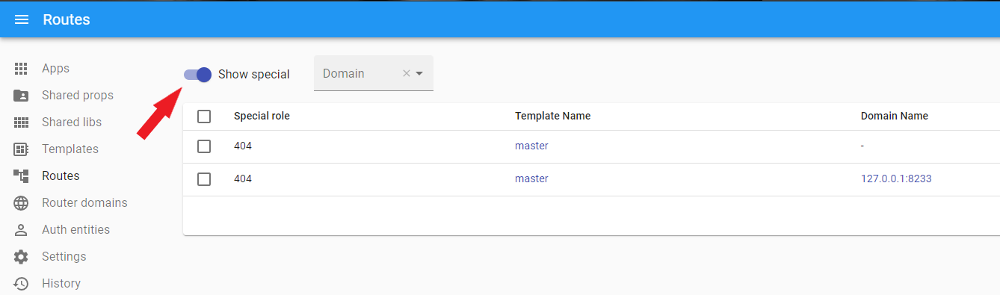
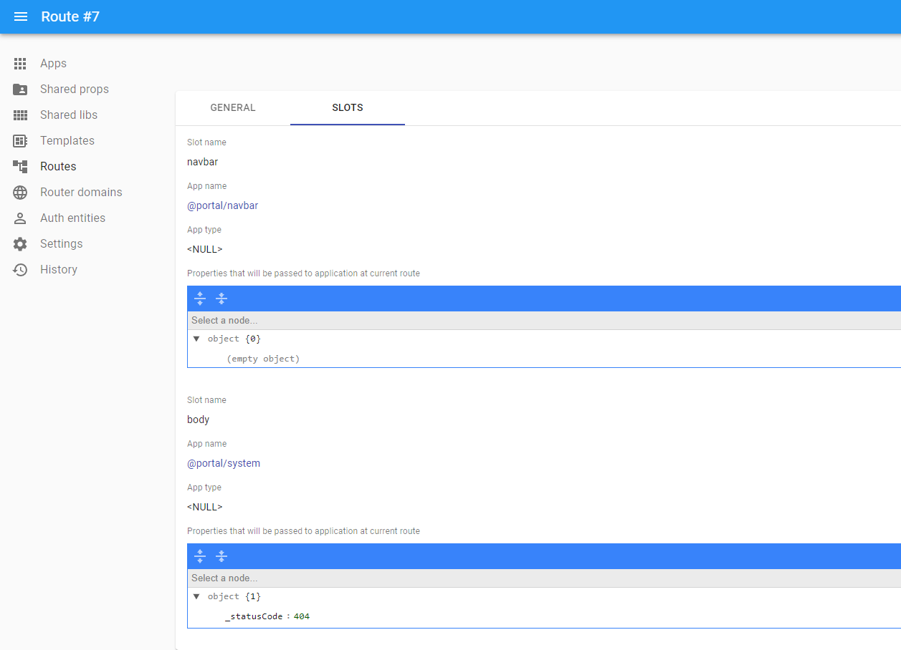
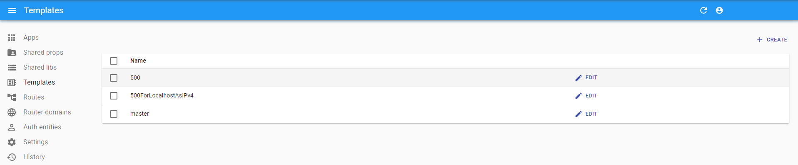
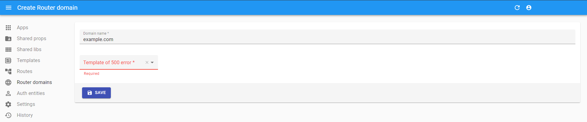

# Error handling in router

Сurrently, ILC can handle [404](#404-error) and [5XX](#5xx-errors) errors only.

This document describes the implementation of errors in ILC.

Since in the micro frontends, a webpage consists of several fragments, the approach to handling errors differs from that used in monolithic frontends.

## '404' error

To see 404 error routes, use the `Show special` switcher at the top of the routes page. `Special route` must be created separately for each domain.

Unlike simple routes that use composition with the help of the `Next` property, the special route has its own configuration. It means that you must add the template and all the necessary applications (for example, header, footer) to the `Special route` [slot](./route_configuration.md#slot-configuration) (see the screenshot below).

More information about the 404 error is available in the [Global error handling page](../global_error_handling.md#404-error-not-found).

## '5XX' errors

ILC render this error as a simple HTML file. This consideration is made to minimize the chances of error occurrence on rendering since if ILC fails, this HTML file will be used by the browser to show an error to the user.

The `500` template acts as the default error template for the main domain.

To assign different error templates to domains, you must specify the template when creating a domain. See the screenshots below.

??? tip "Preview error"
    In ILC, it is possible to preview the 500 error via the `/_ilc/500/` route.

    For example: `http://ilc-demo.namecheap.technology/_ilc/500` is the preview route for the demo website.

More information about the 5xx errors handling is available in the [Global error handling page](../global_error_handling.md#5xx-errors-unexpected-errors).
