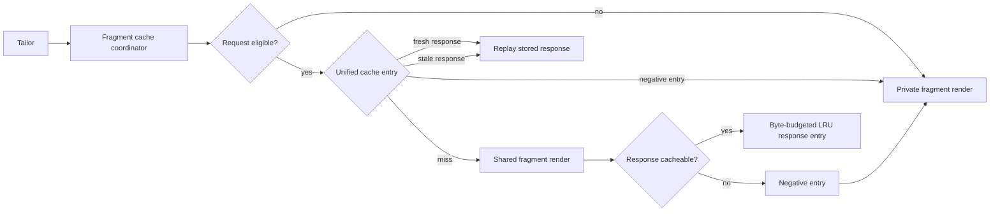

# SSR fragment caching

ILC can serve SSR fragment output from an in-memory cache, so repeatedly requested static fragments are
not re-rendered on every request. Caching is **strictly opt-in**: routes and fragments behave exactly as
before unless caching is explicitly enabled for an app.

## Enabling

Add a `cache` section to the app's `ssr` config in the Registry:

```json
{
    "ssr": {
        "src": "http://fragment-app/render",
        "timeout": 1000,
        "cache": {
            "enabled": true,
            "ttlSeconds": 300
        }
    }
}
```

- `enabled` — required boolean; `false` (or the absent `cache` key) keeps today's behavior.
- `ttlSeconds` — required when `enabled: true`; positive integer up to 30 days (2592000), freshness
  window in seconds. ILC enforces the same contract at runtime: `enabled: true` without a valid
  `ttlSeconds` is not cached.

## What is cached and what never is

A fragment render is cached only when **all** of the following hold:

- `cache.enabled: true` for the app in the Registry;
- the fragment is not wrapped (`wrappedWith` / App Wrappers flow is excluded);
- the fragment does not use `forwardQuerystring` (arbitrary user query params would explode key
  cardinality — the combination is refused);
- the route is not a special route (404 etc.) — its `reqUrl` is the original request URL, so every
  scanned path would become a distinct cache entry; such renders are refused at runtime. For the
  same reason **do not enable caching for apps rendered on wildcard routes** (`/news/*`): the path
  is part of the cache key, and unbounded paths churn the LRU;
- `x-request-host` is present as a string; without it ILC cannot isolate cached output by domain,
  so the request is rendered privately;
- the response status is exactly `200`;
- the response carries no `set-cookie` header (a personalization signal);
- the response does not opt out via `Cache-Control: no-store` or `Cache-Control: private`.

Error and non-2xx responses are never cached; a response interrupted mid-stream is never cached.
Primary fragments are cacheable under the same rules (only complete `200` responses are stored, so
special 404-route handling is unaffected). Requests carrying an `ILC-overrideConfig` cookie (LDE /
develop-in-production) always bypass the cache, so developers see their live changes.

### Fragments rendering prices

Fragments that render prices must never be served from cache: stale pricing is a business and
compliance risk. There is deliberately no automated way to detect "this fragment renders prices",
so the guarantee is layered:

1. Caching is opt-in per app — **do not enable it for price-bearing fragments**.
2. A fragment team can protect itself regardless of Registry config by responding with
   `Cache-Control: no-store` — ILC honours it even when caching is enabled. A response that turns
   out non-cacheable (`no-store`/`private`/`set-cookie`) is never shared between users: every
   request gets its own live render with full user headers. If an entry was already cached before
   the fragment turned dynamic, the first completed refresh replaces it with a **negative entry**.
   Requests arriving while that single refresh is in flight can still receive the stale response;
   once the negative entry is stored, requests go straight to the fragment until cacheability is
   probed again after it expires.

## User isolation (cache key and headers)

The contract: **a request header reaches a cacheable fragment only if its value is part of the cache
key**. Cacheable renders are performed with an anonymous header set — only `x-request-host` and
`x-request-intl` are forwarded; `cookie`, `authorization`, `accept-language`, `referer`, `user-agent`,
`x-request-uri`, all `x-forwarded-*` and `fragmentProxyHeaders` are stripped. This makes it structurally
impossible to serve output personalized for one user to another.

The cache key is composed of: fragment `src`, app id, route (`basePath` + query-stripped `reqUrl`),
`appProps` (including experiment variants), domain (`x-request-host`) and locale/currency
(`x-request-intl`). Keys are stored and logged only as SHA-256 digests, so `ssrProps` or URL tokens
never leak into logs.

The same rule applies to the **query string**: it is neither part of the cache key nor visible to a
cacheable render — `routerProps.reqUrl` arrives query-stripped, so arbitrary UTM/gclid traffic
shares one entry. A fragment that renders query-dependent output server-side must not have caching
enabled (or must answer `Cache-Control: no-store`).

## Lifetime and invalidation

Expiry is TTL-based with **stale-while-revalidate** semantics:
after `ttlSeconds`, requests are served the stale entry immediately while a single background
render refreshes it; concurrent misses for one key are deduplicated into one render.
`ttlSeconds` triggers a refresh but does not bound staleness: if the background render keeps
failing, the last good entry keeps being served indefinitely (each request retriggers a refresh
attempt) — deliberate graceful degradation during fragment outages, at the cost of unbounded
staleness while the fragment is down. A fragment stuck stale shows up as `stale` metrics
persisting past the TTL; the failing background refreshes themselves are reported through the
logger's error channel (the rejection as thrown, without a dedicated message prefix). There is no explicit purge API — pick TTLs accordingly. The cache is in-memory and per ILC instance:
it is empty after every deploy/restart, and hit ratios are per instance. The render deadline derives
from the fragment's own `ssr.timeout` (plus a small slack), never from `ttlSeconds` — a short TTL
cannot abort a slow-but-legal render.

### Runtime architecture

The cache is one request coordinator at the Tailor `requestFragment` seam. Cache policy does not travel
inside fragment attributes: the coordinator explicitly asks the transport for either a private render
(normal forwarded headers) or a shared render (only headers represented in the cache key).



Positive responses and temporary refusals use the same keyed lifecycle. Concurrent misses share only the
anonymous probe; when that probe is refused, each caller receives its own private render. Stale responses
are still served while one background refresh runs. A refresh that returns `private`, `no-store`, or
`set-cookie` atomically replaces the response with a negative entry — the fragment declared itself
uncacheable, deliberately. A refresh that returns a non-2xx status is treated differently: since that is
the one refusal reason likely to be a transient origin blip rather than a deliberate opt-out, it leaves an
existing cached response untouched rather than tombstoning it. A non-2xx on a cold miss (nothing cached
yet) still writes a negative entry, so a failing origin isn't hammered on every request.

## Observability

- New Relic metrics per fragment: `FragmentCache/<appId>/hit|stale|miss|refuse|error` (`error` —
  a render failed while a request was awaiting it, i.e. on a cold miss; the error is rethrown and
  handled as without caching. Failed _background_ refreshes surface in logs, not in this metric).
- A refusal always carries a reason, so `refuse` is diagnosable without reading the code:
  `FragmentCache/<appId>/refuse/<reason>`. Likewise `error` carries `cache-internal` or `fragment`
  to say whose fault it was. These are two separate taxonomies and never share a field.
- Each fragment served through the cache is annotated in the page markup with an HTML comment
  `<!-- ilc:fragment-cache HIT -->` (`HIT` / `STALE` / `MISS`), next to the standard
  `<!-- Fragment #N ... START -->` comment. A refused render is marked with its reason —
  `<!-- ilc:fragment-cache REFUSE:CACHE-CONTROL -->` — which is the only per-request diagnostic
  available in production, since `[ILC Cache]` log entries are emitted at `info` level.

### Refusal reasons

The union in `server/tailor/request-fragment-cache/types/refusal.ts` is the single home of this
taxonomy; the rules stay where they are enforced, but every reason is named in one place.

| Stage    | Reason                     | Meaning                                                                                                              |
| -------- | -------------------------- | -------------------------------------------------------------------------------------------------------------------- |
| request  | `cache-disabled`           | Fragment never opted in. **Not reported** — it is not a refusal, and reporting it would emit on nearly every render. |
| request  | `ttl-invalid`              | `ttlSeconds` missing, non-integer, or not positive.                                                                  |
| request  | `ttl-too-long`             | `ttlSeconds` above the 30-day ceiling shared with the registry schema.                                               |
| request  | `wrapper-conf`             | Fragment renders inside a wrapper, whose output the cache key does not cover.                                        |
| request  | `forward-querystring`      | Fragment forwards the query string, which the key deliberately strips.                                               |
| request  | `special-role-route`       | Special-role route (404 and friends); those renders are never shared.                                                |
| request  | `no-vary-host`             | No `x-request-host` to vary on — a shared entry could leak across hosts.                                             |
| request  | `lde-request`              | Local development environment request, rendered privately on purpose.                                                |
| response | `status-not-200`           | Only 200 responses are shared.                                                                                       |
| response | `set-cookie`               | Response sets cookies — the clearest personalisation signal.                                                         |
| response | `cache-control`            | A directive forbidding reuse without revalidation (RFC 9111 §5.2.2).                                                 |
| capture  | `body-too-large`           | Body exceeded the per-response byte cap.                                                                             |
| capture  | `stream-closed-early`      | Stream closed without `end`; the buffered body would be truncated.                                                   |
| capture  | `unsupported-encoding`     | `Content-Encoding` this cache cannot replay.                                                                         |
| capture  | `decode-failed`            | Decompression failed, including the decompressed-size guard.                                                         |
| runtime  | `capture-budget-exhausted` | Every concurrent-capture slot taken; the render proceeds privately.                                                  |

A negative entry remembers the reason that produced it, so refusals replayed from the tombstone
(up to 60s) report the original cause rather than a second, contextless `refuse`. Stream **errors**
are not refusals: they surface as `error` and are rethrown.

## Operational validation

The automated integration suite verifies that repeated page requests render a cacheable fragment
once, but it is not a production-like load benchmark. Validation of SSR load reduction and response
time on a representative static route remains a rollout prerequisite and must be recorded with the
route, concurrency, cache hit ratio, fragment render count and latency percentiles.

## Trade-offs and limits

- **Per-instance memory cache** — no cross-instance sharing, cold after deploys. Chosen to avoid new
  infrastructure (no Redis in the stack). The `CacheStorage` interface allows swapping the backend for
  another **in-process** one; it does not make a networked backend a drop-in. `CacheStorage.getItem` is
  synchronous (`common/types/CacheWrapper.ts`), so Redis or any out-of-process store would first require
  making the storage contract and the whole `lookup` → `get` → `handle` chain asynchronous. That is
  separate work, not a configuration change.
- **Miss path is buffered** — a cacheable fragment's body is fully buffered before it is streamed into
  the page (required to store it). Enabled fragments are expected to be small, fast, static markup.
- **Body size cap** — bodies larger than 1 MiB (raw or decompressed) are never cached: buffering
  aborts, the response is treated as non-cacheable (negative entry + live streamed renders), so a
  misbehaving fragment degrades to "not cached" instead of exhausting the ILC heap.
- **LRU cap** — the storage holds at most 500 entries and 64 MiB of response bodies in total; evictions are
  logged with a warning. Negative entries have zero body weight. Watch key
  cardinality: every locale, domain, route and `appProps` variant (including experiments) is a separate
  entry.
- **Content encoding** — `gzip` and `deflate` responses are stored decompressed and replayed without
  `content-encoding`; unsupported encodings are treated as non-cacheable and rendered privately.
