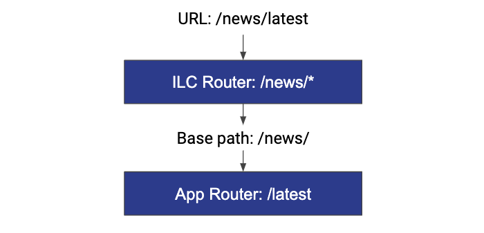
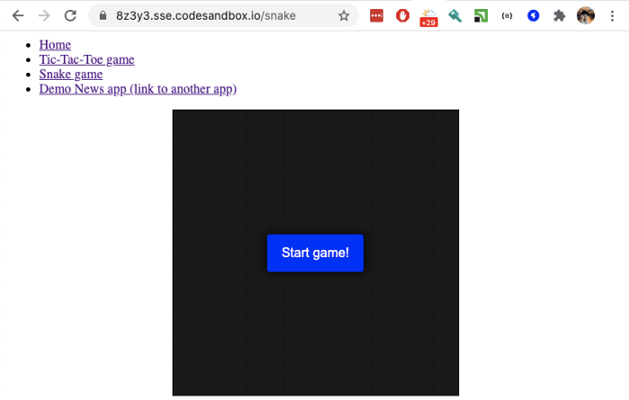
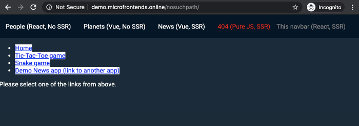

# Step by step apps creation with ILC, React, Lesson 2

This article is the continuation of the [first one that can be found here](./lesson1.md). 
However if you're an experienced developer – feel free to start from this one.

In this part we'll showcase how to turn an app that uses [React router](https://reactrouter.com/web/guides/quick-start) 
into Micro Frontend that works with _Isomorphic Layout Composer_.

A bit of theory...
================

One of the first questions that you need to solve when applying micro frontends architecture is routing. 
It comes from the fact that you no longer have a single React/Vue.js/etc app that handles all the route transitions. 
Now you have multiple apps working simultaneously on the web page, and you somehow need to understand which apps should 
be active on the page for the current URL.

We, in _Isomorphic Layout Composer_ (ILC), solve this by using so-called "2-tiered routing" approach.



In this example the user opened a page at `/news/latest` URL. It correlates to the `/news/*` route configured in ILC, 
this route contains information about apps that should be loaded on the page and props they need to receive. 
When we load and mount the application to its container DOM node  – we also pass `basePath` property which should be 
used by application's router during its work.

But enough theory – let's see some real code.

Starting point
==============

We'll start from the sample React app that has 3 internal routes: Home, Tic-Tac-Toe game and Snake game.

Please go and grab it here: <https://github.com/StyleT/ilc-learning-react/tree/step_2-Router> 
(you need to use `step_2-Router` branch). After git clone, run `npm i && npm start`.

Or you can use [codesandbox.io](https://codesandbox.io/s/github/StyleT/ilc-learning-react/tree/step_2-Router) to have 
it running for you in the cloud. 
I would recommend to use [codesandbox.io](https://codesandbox.io/s/github/StyleT/ilc-learning-react/tree/step_2-Router) 
to eliminate all the local environment related issues that may appear as we move forward.

As soon as you started the app  – try to go through the links in the menu, disable JavaScript execution to see SSR output, etc...

If you just finished the [1st lesson](./lesson1.md) – look at the diff between `master` branch and `step_2-Router`. See what was changed.



Adapting the app to ILC
=======================

To make our React app play together with ILC – we need to make it compliant with [ILC to App interface](https://github.com/namecheap/ilc/blob/b4622ee06f6c3e52a045d156ba346eeb90b51237/docs/ilc_app_interface.md). Fortunately that's pretty easy, go through the source code and resolve all the `//TODO:` comments I placed for you there.

As soon as you're finished with this – restart the app and try to open `/microfrontend` route. You should get `200 OK` response code & some SSR markup.

> Note: in case of any troubles – try to switch to the `step_2-Router_ILC_integrated` branch in the repo  – it has all the changes already done for you.

Configuring ILC to handle new app
=================================

In this step we're gonna use our public demo website and "[Develop right at "production"](../../develop_at_production.md)" ILC feature to complete the task. We will do it for the sake of simplicity only. However you can achieve pretty the same results using ILC that you run locally.

More info about how to determine public & SSR paths for your particular case – you can find [in the previous lesson](./lesson1.md).

Now let's open [demo.microfrontends.online/nosuchpath](http://demo.microfrontends.online/nosuchpath) and by setting "magic cookie" in our browser  – let's change ILC config on the fly:

```javascript
var publicPath = 'https://abcde.sse.codesandbox.io/public/';
var ssrPath = 'https://abcde.sse.codesandbox.io/microfrontend';

var overrideConfig = encodeURIComponent(JSON.stringify({
    apps: {
        '@portal/myapp': {
            spaBundle: publicPath + 'client.js',
            cssBundle: publicPath + 'style.css',
            ssr: {
                src: ssrPath,
                timeout: 10000,
            },
            props: { publicPath },
            kind: 'primary',
        },
    },
    routes: [{
        routeId: 555,
        route: '/nosuchpath/*',
        slots: {
            body: {
                appName: '@portal/myapp'
            }
        }
    }]
}));

document.cookie = `ILC-overrideConfig=${overrideConfig}; path=/;`
```

Refresh the page after code execution. If you did everything correctly – you should be able to see your app running inside a public ILC demo website.

> If it doesn't work for you  – ensure that `ssrPath` is accessible not only from your machine (use <https://reqbin.com/>) and JS/CSS links are actually working from your machine.

Exploring the results
=====================



Now you can try to play some Tic-Tac-Toe and Snake games by following the links to the corresponding pages within your own Micro Frontend 😎

Pay attention to the "Demo News app" link. Even despite the fact that it's a regular `<a>` tag  – it doesn't cause page reload and smoothly loads another app. This is one of the features of the ILC that help to make it work with legacy monolithic apps.

Also try to disable JS execution and go through the links again. See that all of the pages look exactly as with JS enabled (apart from the fact that you can't play games now).

Summary
=======

In a matter of a half an hour we turned the simplest React-router based app into a Micro Frontend and I hope it went nice and easy for you.

Micro Frontends architecture is quite complex when you start to work with it. But a proper toolchain that [Isomorphic Layout Composer](https://github.com/namecheap/ilc) delivers  – can simplify things a lot.